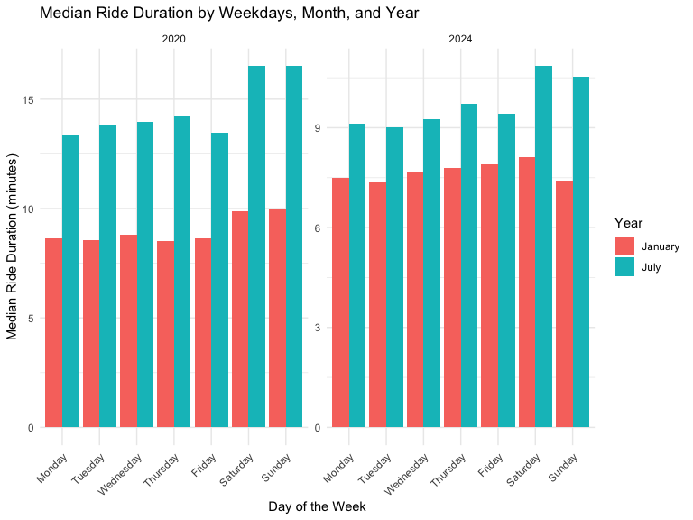

HW3
================
Zhenkun Fang
2024-10-14

# Problem 1

This dataset consists of 2595176 rows and 7 columns. The variables
include the weather station ID, observation date, precipitation
(measured in tenths of millimeters), snowfall (in millimeters), snow
depth (in millimeters), and both minimum and maximum temperatures (in
tenths of degrees Celsius).

``` r
ny_noaa %>% 
  count(tmax) %>%
  arrange(desc(n))
```

    ## # A tibble: 533 × 2
    ##    tmax        n
    ##    <chr>   <int>
    ##  1 <NA>  1134358
    ##  2 256     30736
    ##  3 267     30692
    ##  4 244     28909
    ##  5 239     28628
    ##  6 233     27902
    ##  7 250     27392
    ##  8 228     27342
    ##  9 261     26654
    ## 10 278     26355
    ## # ℹ 523 more rows

``` r
ny_noaa %>% 
  count(tmin) %>%
  arrange(desc(n))
```

    ## # A tibble: 549 × 2
    ##    tmin        n
    ##    <chr>   <int>
    ##  1 <NA>  1134420
    ##  2 0       32431
    ##  3 -11     31385
    ##  4 6       30763
    ##  5 -22     30502
    ##  6 -17     30163
    ##  7 -6      28909
    ##  8 17      28771
    ##  9 100     27891
    ## 10 128     27391
    ## # ℹ 539 more rows

For vairbles `tmax` and `tmin`, nearly half of the observations are
`NA`, indicating that there is a serious issue of missing data.

``` r
ny_noaa %>% 
  count(snow) %>%
  arrange(desc(n))
```

    ## # A tibble: 282 × 2
    ##     snow       n
    ##    <int>   <int>
    ##  1     0 2008508
    ##  2    NA  381221
    ##  3    25   31022
    ##  4    13   23095
    ##  5    51   18274
    ##  6    76   10173
    ##  7     8    9962
    ##  8     5    9748
    ##  9    38    9197
    ## 10     3    8790
    ## # ℹ 272 more rows

``` r
ny_noaa = 
  ny_noaa %>% 
  separate(date, into = c("year", "month", "day"), convert = TRUE) %>% 
  mutate(
    tmax = as.numeric(tmax),
    tmin = as.numeric(tmin))
```

For the variable `snow`, the most frequently observed value is 0,
reflecting that snowfall does not occur on most days in NY. The second
most common value is `NA`, indicating missing data.

``` r
ny_noaa %>% 
  group_by(id, year, month) %>% 
  filter(month %in% c(1, 7)) %>% 
  summarize(mean_tmax = mean(tmax, na.rm = TRUE, color = id)) %>% 
  ggplot(aes(x = year, y = mean_tmax, group = id)) + geom_point() + geom_path() +
  facet_grid(~month) +
  labs(title = "Mean monthly temperature for each station across years for January and July",
       x = "Year",
       y = "Average max temperature")
```

    ## `summarise()` has grouped output by 'id', 'year'. You can override using the
    ## `.groups` argument.


The two-panel plot below displays the average maximum temperature in
January and July across stations over the years. As expected, the mean
temperature in January is significantly lower than in July for all
stations and years. The stations generally follow similar temperature
patterns, with peaks and valleys within each month across the years—when
one station has a high monthly mean temperature for a given year, most
other stations exhibit a similar trend. However, there is one notably
cold station in July of 1987 or 1988, along with a few other less
extreme outliers.

``` r
hex = 
  ny_noaa %>% 
  ggplot(aes(x = tmin, y = tmax)) + 
  geom_hex()

ridge = 
  ny_noaa %>% 
  filter(snow < 100, snow > 0) %>% 
  ggplot(aes(x = tmax, y = as.factor(year))) + 
  geom_density_ridges(scale = .90)
  
hex+ridge
```

    ## Picking joint bandwidth of 8.06


# Problem 2

``` r
demodata = 
  read_csv("/Users/rubp/Desktop/Data Sci 1/Week7/p8105_hw3_zf2352/nhanes_covar.csv",
            na = c("NA", ".", "")) %>% 
  janitor::clean_names() 
```

    ## New names:
    ## Rows: 254 Columns: 5
    ## ── Column specification
    ## ──────────────────────────────────────────────────────── Delimiter: "," chr
    ## (5): ...1, 1 = male, ...3, ...4, 1 = Less than high school
    ## ℹ Use `spec()` to retrieve the full column specification for this data. ℹ
    ## Specify the column types or set `show_col_types = FALSE` to quiet this message.
    ## • `` -> `...1`
    ## • `` -> `...3`
    ## • `` -> `...4`

``` r
accel = 
  read_csv("/Users/rubp/Desktop/Data Sci 1/Week7/p8105_hw3_zf2352/nhanes_accel.csv",
            na = c("NA", ".", "")) %>% 
  janitor::clean_names()
```

    ## Rows: 250 Columns: 1441
    ## ── Column specification ────────────────────────────────────────────────────────
    ## Delimiter: ","
    ## dbl (1441): SEQN, min1, min2, min3, min4, min5, min6, min7, min8, min9, min1...
    ## 
    ## ℹ Use `spec()` to retrieve the full column specification for this data.
    ## ℹ Specify the column types or set `show_col_types = FALSE` to quiet this message.

``` r
demodata = 
  demodata[-c(1 ,2 ,3 , 4), ]

colnames(demodata) [1] = "seqn"
colnames(demodata) [2] = "sex"
colnames(demodata) [3] = "age"
colnames(demodata) [4] = "bmi"
colnames(demodata) [5] = "education"

demodata = demodata %>% 
  mutate(seqn = as.numeric(seqn))

accel = accel %>% 
  mutate(seqn = as.numeric(seqn))

mims = demodata %>% 
  left_join(accel, by = "seqn") %>% 
  drop_na(bmi, education) %>% 
  filter(age >= 21) %>% 
  mutate(
    sex = factor(sex, levels = c(1, 2), labels = c("Male", "Female")),
    education = factor(education, levels = c(1, 2, 3), 
                       labels = c("Less than high school",
                              "High school equivalent",
                              "More than high school")),
    age = as.numeric(age),
    bmi = as.numeric(bmi)
  )
```

``` r
mims_table = mims %>% 
  count(sex, education) %>% 
  spread(sex, n) %>% 
  knitr::kable()

mims_table
```

| education              | Male | Female |
|:-----------------------|-----:|-------:|
| Less than high school  |   27 |     28 |
| High school equivalent |   35 |     23 |
| More than high school  |   56 |     59 |

``` r
mims_ridge = mims %>% 
  ggplot(aes(x = age, y = as.factor(education))) + 
  facet_grid(~sex) +
  geom_density_ridges(scale = .90) +
  labs(
    title = "Age distributions for men and women in each education category",
    x = "Age (years)",
    y = "Education"
  )

mims_ridge
```

    ## Picking joint bandwidth of 8.11

    ## Picking joint bandwidth of 7.95


The distribution across education levels shows that there is a fairly
balanced gender representation in the “Less than high school” and “More
than high school” categories. However, for the “High school equivalent”
category, there is a notable gender disparity, with more males than
females.

The gender distribution within each education category is relatively
balanced, though there are slight variations, particularly in the “High
school equivalent” category where males outnumber females around the age
of 30. For both sexes, participants with “Less than high school”
education tend to be older, particularly concentrated in the 60-80 age
range, which might suggest that older individuals in this dataset tend
to have less formal education.

``` r
mims_total = mims %>% 
  rowwise() %>% 
  mutate(total_activity = sum(c_across(starts_with("min")), na.rm = TRUE)) %>% 
  relocate(last_col(), .before = 6)
```

``` r
mims_total %>% 
  ggplot(aes(x = age, y = total_activity, color = sex)) +
  geom_point(alpha = .5) +
  geom_smooth(se = FALSE) + 
  facet_grid(. ~ education) +
  labs(
    x = "Age (years)",
    y = "Total accelerometer activity",
    title = "Total accelerometer activity of men and women with different education"
  )
```

    ## `geom_smooth()` using method = 'loess' and formula = 'y ~ x'


Across all education categories, there is a noticeable decrease in total
accelerometer activity as age increases, particularly after age 60. This
trend is consistent with expectations that physical activity generally
decreases as people age.

- Less than high school: Men tend to have a slight edge in activity
  levels compared to women, particularly in younger age groups, though
  both genders show a steep decline in activity after age 60. The smooth
  trend for women appears to dip more significantly at older ages.

- High school equivalent: In this group, women’s activity levels seem to
  peak around middle age (40–50 years) and remain higher than men’s for
  a significant portion of the age range. However, the activity levels
  for both men and women drop sharply after age 60.

- More than high school: In the more educated group, men and women have
  more comparable activity levels, with some fluctuations around age
  40–60. Women’s activity seems to remain relatively higher at older
  ages in this category.

``` r
mims_total_long = mims_total %>% 
  pivot_longer(cols = starts_with("min"), 
               names_to = "minute", 
               values_to = "activity") %>% 
  mutate(minute = as.numeric(gsub("min", "", minute))) %>% 
  group_by(education, sex, minute) %>% 
  summarise(avg_activity = mean(activity, na.rm = TRUE))
```

    ## `summarise()` has grouped output by 'education', 'sex'. You can override using
    ## the `.groups` argument.

``` r
mims_total_long %>% 
  ggplot(aes(x = minute, y = avg_activity, color = sex)) +
  geom_line(alpha = .5) +  
  geom_smooth(method = "loess", se = FALSE) +
  facet_wrap(~ education) +
  labs(
    x = "Minute in 24 hours",
    y = "Average activity",
    title = "24-hour activity time courses for each education level"
  )
```

    ## `geom_smooth()` using formula = 'y ~ x'



Across all education levels, the activity levels follow a similar daily
pattern, with a sharp increase in activity after the start of the day
(around minute 500, corresponding to roughly 8 AM), peaking around
midday, and then gradually declining into the evening.

In general, women appear to have slightly higher activity levels
throughout the day compared to men across all education levels,
especially during the peak activity hours around midday. The smooth
trends for women (in teal) often show a more sustained or higher peak of
activity than men (in red), particularly in the “High school equivalent”
and “More than high school” groups.

Participants with more education tend to have higher activity levels
overall, especially during the peak hours of the day. In the “more than
high school” group, the curves for both men and women show a higher
midday peak, which could suggest a more active and structured lifestyle.
Women in this group show a particularly strong midday peak, indicating
higher physical engagement during daytime hours.
